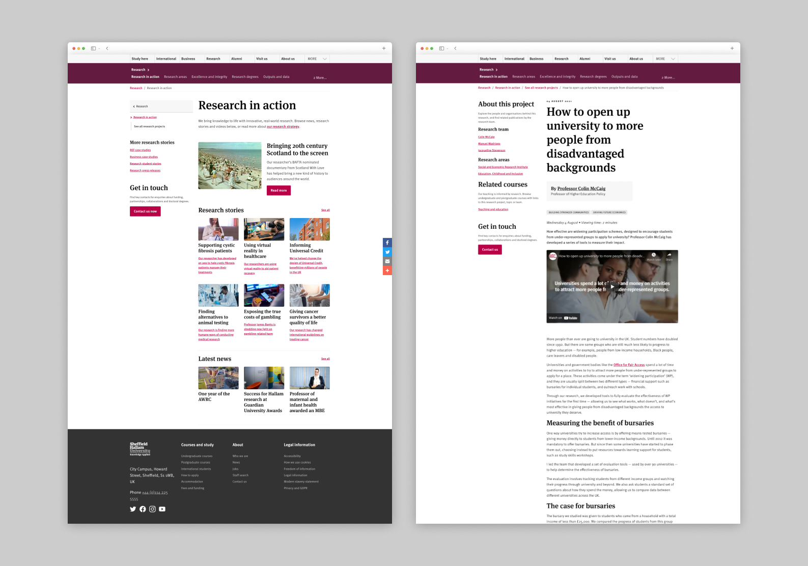
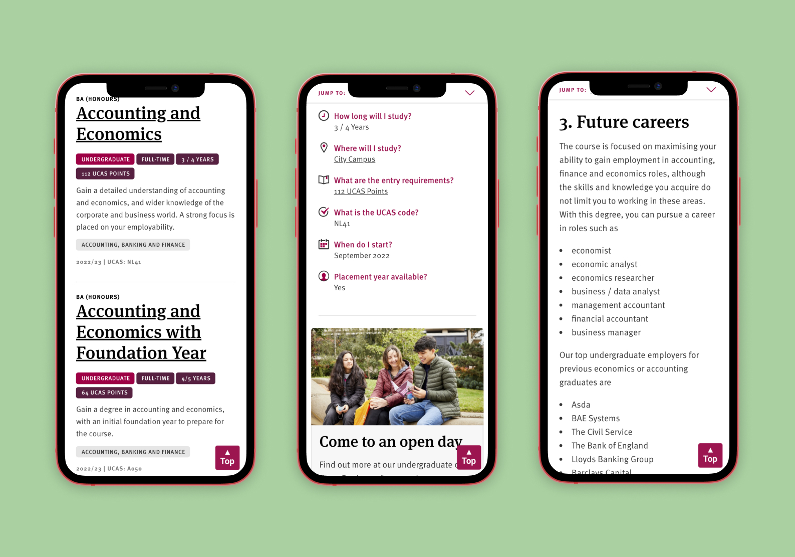

---
# Page settings
layout: default # Choose layout: "default", "homepage" or "documentation-archive"
title: Service design projects # Define a title of your page
description: List of projects displaying a range of techniques and methods to create great services and products # Define a description of your page
keywords: # Define keywords for search engines
comments: false # Set to "true" in order to enable comments on this page. Make sure you properly setup "disqus_forum_shortname" variable in "_config.yml"
---

###### [Aligning the research experience across centres, projects and staff](portfolio/research.md)
 

###### [Helping users find the right course](portfolio/teamhallam.md)
 

###### [Designing an inclusive sports brand for players and supporters](portfolio/teamhallam.md)
 

###### [Designing an event booking portal for propsective students](portfolio/events.md)
 

###### [Improving the Phd study enquiry journey](portfolio/projPGR.md)
 

###### [Welcome - designing a onboarding portal for new students](portfolio/welcome.md)
 

###### [Focusing on virtual events during the pandemic](portfolio/virtualopen.md)
 

###### [Designing the disabled student stupport service](portfolio/dss.md)

